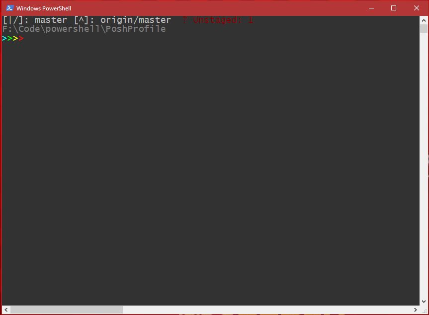

# POSH Profile
My Powershell Profile. Has Git support for Git repositories. Define a config.ps1 file in the root folder with the profile to add any PSDrives, Import Scripts, etc. 

* Font Size: `18`
* Font Name: `Lucida Console`
* Screen Background: `RGB(50,50,50)`